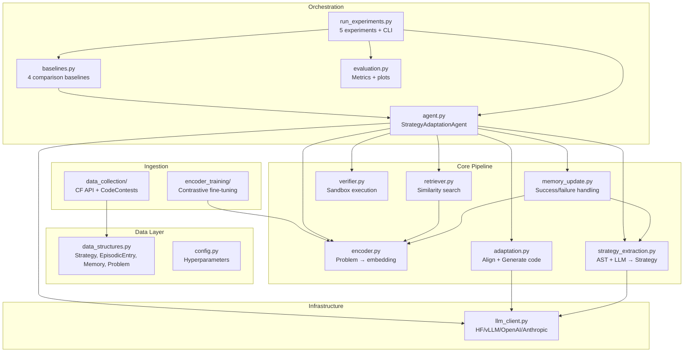

# SAGE Implementation Plan

## Architecture Overview



## Component Inventory

| Component | File(s) | Status | Notes |
|-----------|---------|--------|-------|
| Data structures | `data_structures.py` | **COMPLETE** | Clean dataclasses |
| Config | `config.py` | **COMPLETE** | Centralized params |
| LLM Client | `llm_client.py` | **COMPLETE** | 4 backends + role-aware wrapper |
| Strategy Extraction | `strategy_extraction.py` | **COMPLETE** | AST + LLM two-stage |
| Problem Encoder | `encoder.py` | **COMPLETE** | SentenceTransformer wrapper |
| Retriever | `retriever.py` | **COMPLETE** | Cosine + Random + TagOracle |
| Adaptation | `adaptation.py` | **COMPLETE** | G1-G6 + fallback chain |
| Verifier | `verifier.py` | **COMPLETE** | Subprocess sandbox |
| Memory Update | `memory_update.py` | **COMPLETE** | Success/failure paths |
| Agent | `agent.py` | **COMPLETE** | Main loop + checkpointing |
| Baselines | `baselines.py` | **COMPLETE** | 4 baselines |
| Experiments | `run_experiments.py` | **COMPLETE** | 5 experiments + CLI |
| Evaluation | `evaluation.py` | **COMPLETE** | Metrics + matplotlib |
| Data Collection | `data_collection/` | **COMPLETE** | CF API + CodeContests |
| Encoder Training | `encoder_training/` | **COMPLETE** | MNRL + Triplet |
| **Unit Tests** | — | **MISSING** | Zero test files exist |
| **Integration Tests** | — | **MISSING** | No end-to-end test |
| **Experiment 6** | `run_experiments.py` | **DESIGNED NOT CODED** | Multi-model generalization |

## Conflicts & Resolutions

1. **No test infrastructure exists.** The repo has no `tests/` directory, no pytest config, no test fixtures. **Resolution:** Create `tests/` with conftest.py providing shared fixtures (mock LLM, sample problems, sample memory).

2. **`memory_update.py` calls `strategy_extraction.extract_strategy` which requires an LLM client.** Testing memory update in isolation requires mocking the LLM. **Resolution:** All tests that touch LLM-dependent code will use a deterministic mock client returning canned JSON.

3. **`verifier.py` runs subprocesses.** Tests need actual subprocess execution for the verifier to be meaningful. **Resolution:** Verifier tests will use real subprocess execution with trivial Python programs (no mocking needed — it's fast and deterministic).

4. **Encoder requires `sentence_transformers` which may not be installed in CI.** **Resolution:** Encoder tests will mock SentenceTransformer if not importable; one integration test will skip if unavailable.

---

## Implementation Checklist

All new files go under `tests/`. Each item lists the file path, what to implement, and dependencies.

### Phase 1: Test Infrastructure

- [ ] **1.1** `tests/__init__.py` — Empty package init
- [ ] **1.2** `tests/conftest.py` — Shared pytest fixtures:
  - `mock_llm_client()` → Returns a `MockLLMClient` that returns deterministic responses based on prompt content
  - `sample_problem()` → Returns a `Problem` instance with realistic fields
  - `sample_strategy()` → Returns a `Strategy` instance
  - `sample_memory()` → Returns a `Memory` with 3 pre-populated entries (with embeddings)
  - `sample_episodic_entry()` → Returns a single `EpisodicEntry`
  - `verifier()` → Returns a real `Verifier(timeout_seconds=5)`

### Phase 2: Unit Tests for Core Components

- [ ] **2.1** `tests/test_data_structures.py` — Test data structure creation and invariants:
  - `test_strategy_creation` — Create Strategy, verify all fields
  - `test_episodic_entry_defaults` — Verify default counters (times_retrieved=0, etc.)
  - `test_memory_add_entry` — Add entry to Memory, verify it's retrievable
  - `test_memory_empty` — Fresh Memory has no entries
  - `test_problem_creation` — Create Problem with all fields
  - `test_failure_annotation_creation` — Create FailureAnnotation

- [ ] **2.2** `tests/test_verifier.py` — Test code verification:
  - `test_correct_solution` — Simple A+B program passes
  - `test_wrong_answer` — Incorrect output detected
  - `test_runtime_error` — Division by zero caught
  - `test_timeout` — Infinite loop times out (use short timeout)
  - `test_empty_code` — Empty string handled gracefully
  - `test_output_normalization` — Trailing whitespace/newlines ignored
  - `test_multiple_test_cases` — All must pass for overall pass

- [ ] **2.3** `tests/test_retriever.py` — Test retrieval logic:
  - `test_retrieve_returns_top_k` — Returns exactly k entries
  - `test_retrieve_empty_memory` — Returns empty list
  - `test_retrieve_filters_unverified` — Entries with verification_passed=False excluded
  - `test_retrieve_filters_no_embedding` — Entries without embedding excluded
  - `test_retrieve_ordering` — Results sorted by descending similarity
  - `test_random_retriever` — Returns k entries with score 0.5
  - `test_tag_oracle_retriever` — Prefers entries with matching tags

- [ ] **2.4** `tests/test_strategy_extraction.py` — Test extraction pipeline:
  - `test_extract_code_structure_simple` — Basic Python with loop
  - `test_extract_code_structure_recursion` — Detect recursion
  - `test_extract_code_structure_dp_pattern` — Detect DP pattern (array + nested loops)
  - `test_is_python_detection` — Python vs C++ vs Java
  - `test_parse_json_response` — Extract JSON from markdown-fenced LLM output
  - `test_parse_json_response_no_fence` — Plain JSON extraction
  - `test_validate_strategy_valid` — Valid strategy dict passes
  - `test_validate_strategy_missing_fields` — Missing required fields flagged
  - `test_extract_strategy_with_mock_llm` — Full pipeline with mocked LLM returns Strategy object
  - `test_format_ast_features` — AST feature dict → readable string

- [ ] **2.5** `tests/test_adaptation.py` — Test adaptation pipeline:
  - `test_extract_python_code_markdown` — Extract code from ```python block
  - `test_extract_python_code_plain` — Extract code from plain ``` block
  - `test_extract_adapted_plan` — Extract ### ADAPTED PLAN section
  - `test_format_retrieved_strategies` — Format strategies for prompt
  - `test_adapt_and_solve_with_mock` — Full pipeline returns code string
  - `test_free_generation_with_mock` — G1 mode returns code
  - `test_solve_with_fallbacks_first_succeeds` — Stops at first success
  - `test_solve_with_fallbacks_all_fail` — Falls back to free generation

- [ ] **2.6** `tests/test_memory_update.py` — Test memory management:
  - `test_handle_success_adds_entry` — New entry created after successful solve
  - `test_handle_success_updates_stats` — Retrieved entries get success counter bumped
  - `test_handle_failure_adds_annotation` — FailureAnnotation recorded
  - `test_handle_failure_updates_stats` — Retrieved entries get failure counter bumped
  - `test_update_memory_success_path` — End-to-end success path
  - `test_update_memory_failure_path` — End-to-end failure path

- [ ] **2.7** `tests/test_encoder.py` — Test encoder:
  - `test_encode_returns_normalized_vector` — Output is unit-norm float32
  - `test_encode_deterministic` — Same input → same output
  - `test_batch_encode_matches_single` — Batch and single encode give same results
  - `test_create_encoder_fallback` — Falls back to base when no fine-tuned model

- [ ] **2.8** `tests/test_llm_client.py` — Test LLM client:
  - `test_strip_thinking` — Removes `<think>...</think>` blocks
  - `test_strip_thinking_no_block` — Passthrough when no think block
  - `test_role_aware_client_alignment_role` — `:align` suffix enables thinking
  - `test_role_aware_client_generation_role` — `:generate` suffix disables thinking

### Phase 3: Integration Tests

- [ ] **3.1** `tests/test_integration.py` — End-to-end pipeline tests:
  - `test_seed_and_retrieve` — Seed memory, encode problem, retrieve → gets relevant entry
  - `test_full_pipeline_mock` — Problem → retrieve → adapt → verify → memory update (all with mock LLM, real verifier)
  - `test_agent_run_single_problem` — StrategyAdaptationAgent.run() with 1 problem
  - `test_checkpoint_save_load` — Save checkpoint, load it, verify state matches

### Phase 4: Dataset Utility Tests

- [ ] **4.1** `tests/test_dataset_utils.py` — Test data pipeline utilities:
  - `test_normalize_tags` — CF tags mapped to canonical set
  - `test_normalize_tags_unknown` — Unknown tags dropped
  - `test_validate_problem_valid` — Complete problem passes
  - `test_validate_problem_missing_statement` — Flagged as invalid
  - `test_dict_to_problem` — Dict conversion produces correct Problem
  - `test_build_full_statement` — Sections concatenated properly
  - `test_create_splits_temporal` — Splits respect contest date ordering

### Phase 5: Run Tests & Verify

- [ ] **5.1** `pytest.ini` or `pyproject.toml` — pytest configuration:
  - Test discovery in `tests/`
  - Markers: `unit`, `integration`, `slow`
  - Default: run unit tests only (`-m "not slow"`)

- [ ] **5.2** Run full test suite, ensure all tests pass
- [ ] **5.3** Verify no regressions in existing code (import checks, no modified behavior)

---

## Implementation Notes

### MockLLMClient Design
The mock should handle different prompt types by keyword detection:
- If prompt contains "extract" + "strategy" → return valid strategy JSON
- If prompt contains "adapt" or "alignment" → return alignment response with ### ADAPTED PLAN
- If prompt contains "generate" or "code" → return simple Python code in markdown fence
- If prompt contains "diagnos" → return failure diagnosis text
- Default → return generic response

### Test Problem Fixtures
Use a realistic but minimal problem:
```python
Problem(
    problem_id="TEST001",
    contest_id=1000,
    index="A",
    title="Sum of Two",
    statement="Read two integers and print their sum.",
    difficulty_rating=800,
    algorithm_tags=["implementation"],
    test_cases=[{"input": "2 3", "output": "5"}, {"input": "0 0", "output": "0"}],
    editorial=None,
    reference_solutions=[{"code": "a,b=map(int,input().split())\nprint(a+b)", "language": "Python 3"}],
    contest_date="2020-01-01"
)
```

### What We Are NOT Changing
- No modifications to existing module behavior
- No new features beyond tests
- No refactoring of working code
- Existing experiment orchestration remains untouched
